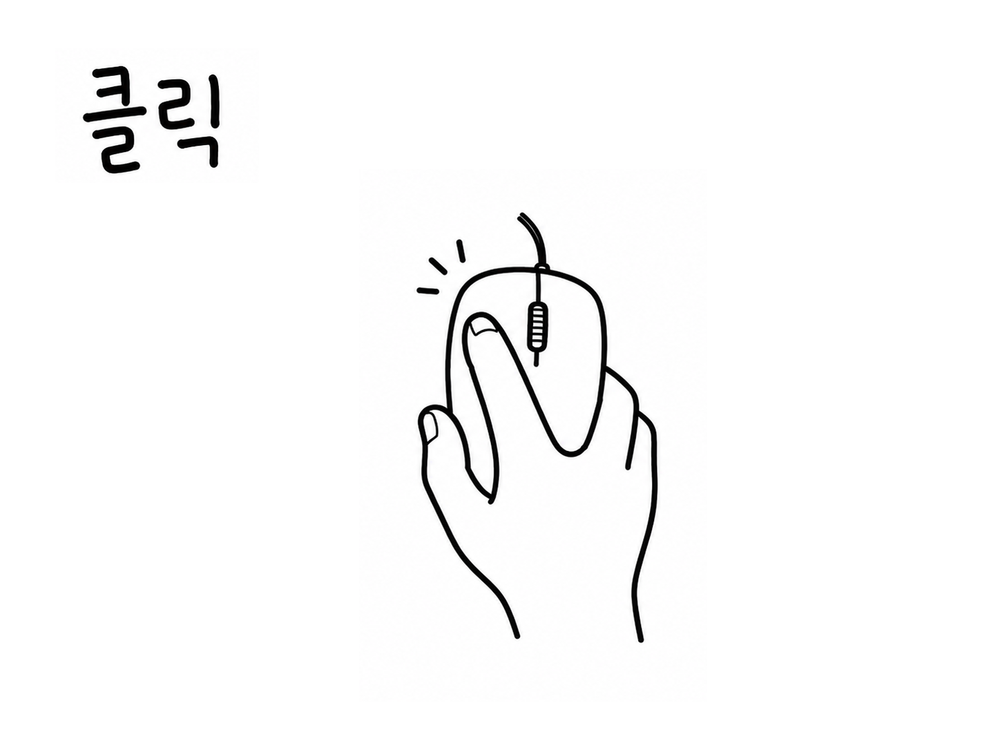
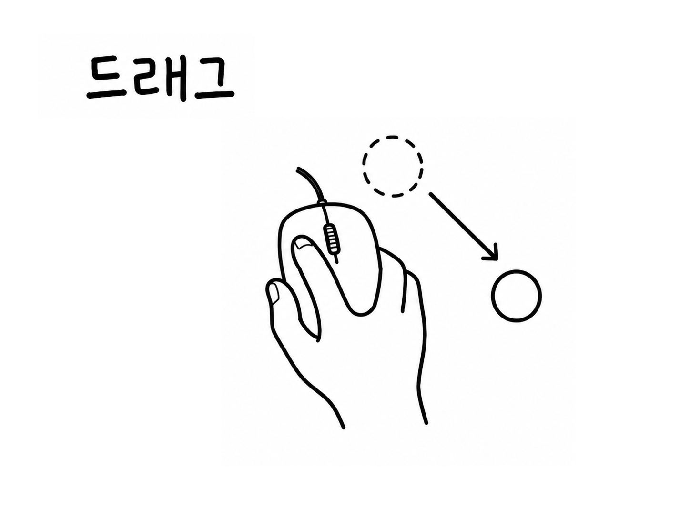
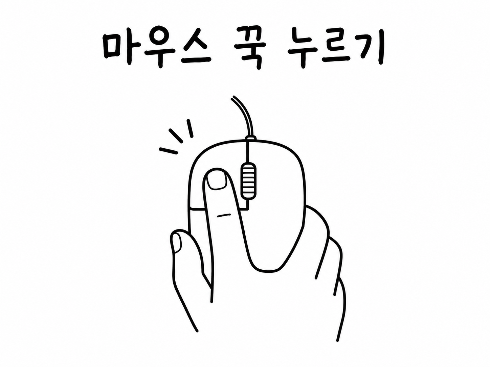

# 캣타워 오르기

<p align="center">
  
</p>

<p align="center">
  박자에 맞춰 쏟아지는 짧은 미션을 해결하고, 목숨을 지키며 더 높은 층까지 올라가는 웹 마이크로게임입니다.
</p>

<p align="center">
  
  
  
  
</p>

<p align="center">
  
  
  
</p>

## 한눈에 보기

캣타워 오르기는 WarioWare 스타일의 초단기 미션을 Next.js와 Canvas로 구현한 리듬형 웹 게임입니다. 매 라운드마다 조작법이 먼저 제시되고, 플레이어는 제한된 박자 안에 과제 제출, 오카리나 연주, 알까기, 포켓몬 이름 맞히기, 전선 연결, 가시 피하기 같은 미션을 해결해야 합니다.

| 항목        | 내용                                             |
| ----------- | ------------------------------------------------ |
| 장르        | 박자 기반 마이크로게임                           |
| 플랫폼      | Web                                              |
| 라운드 구조 | 조작법 안내 -> 미션 -> 성공/실패 판정            |
| 선택 규칙   | 세션 랜덤 bag, 직전 게임 즉시 반복 방지          |
| 보스 규칙   | 12라운드마다 보스 microgame pool에서 라운드 선택 |
| 저장        | `localStorage` 최고 기록 및 도감 발견 기록 저장  |
| 에셋        | `public/games/*/images`, `public/games/*/sounds` |

## 게임 흐름

```txt
에셋 프리로드
  -> 메인 화면
  -> 조작법 안내
  -> 시작 프롬프트
  -> 박자 제한 미션
  -> 성공 / 실패 판정
  -> 속도 증가 또는 목숨 회복
  -> 12라운드마다 보스 라운드
  -> 게임 오버 및 최고 기록 저장
```

## 마이크로게임 목록

| 게임                          | 미션                         | 조작                | 박자 | 종류 |
| ----------------------------- | ---------------------------- | ------------------- | ---- | ---- |
| 과제 제출                     | `과제를 제출해라!`           | 마우스 클릭         | 8    | 일반 |
| 레이튼 교수와 이상한 마을     | `같은 모양을 찾아라!`        | 숫자키              | 8    | 일반 |
| 리그 오브 레전드              | `챔피언을 밴해라!`           | 마우스 클릭         | 12   | 일반 |
| 마인크래프트                  | `다이아몬드를 캐라!`         | 마우스 hold         | 8    | 일반 |
| 말랑말랑 두뇌교실             | `블록은 몇 개?`              | 숫자키              | 12   | 일반 |
| 메이플스토리                  | `입력해라!`                  | 한글 키보드         | 12   | 일반 |
| 메이플스토리 룬               | `순서대로 입력해라!`         | 방향키              | 8    | 일반 |
| 모두의 마블                   | `큰 수를 굴려라!`            | 마우스 hold         | 8    | 일반 |
| 모여봐요 동물의 숲            | `찍어라!`                    | 마우스 클릭         | 8    | 일반 |
| 미니게임EX                    | `곰을 잘봐라!`               | 숫자키              | 16   | 일반 |
| 별의 커비: 울트라 슈퍼 디럭스 | `빨아들여라!`                | 마우스 hold         | 8    | 일반 |
| 사과게임                      | `10을 만들어라!`             | 마우스 드래그       | 12   | 일반 |
| 슈퍼 마리오                   | `코인을 정확히 모아라!`      | 스페이스바          | 8    | 일반 |
| 슈퍼마리오 갤럭시             | `스타구슬을 모아라!`         | 마우스 드래그       | 12   | 일반 |
| 알까기                        | `적 돌을 밀어내라!`          | 마우스 드래그       | 8    | 일반 |
| 어몽어스                      | `연결해라!`                  | 마우스 드래그       | 14   | 일반 |
| 언더테일                      | `피해라!`                    | 방향키              | 8    | 일반 |
| 오목                          | `흰돌을 놓아 이겨라!`        | 마우스 클릭         | 8    | 일반 |
| 젤다의 전설: 스카이워드 소드  | `동그라미를 그려라!`         | 마우스 드래그       | 12   | 일반 |
| 젤다의 전설: 시간의 오카리나  | `연주해라!`                  | 방향키 + 스페이스바 | 12   | 일반 |
| 지오메트리 대시               | `가시를 피해라!`             | 스페이스바          | 12   | 일반 |
| 쿠키런                        | `달려라!`                    | 방향키 + 스페이스바 | 12   | 일반 |
| 크레이지 아케이드             | `물풍선을 설치해라!`         | 방향키 + 스페이스바 | 12   | 일반 |
| 크롬 공룡게임                 | `점프해라!`                  | 스페이스바          | 8    | 일반 |
| 테트리스                      | `4줄 없애라!`                | 방향키 + 스페이스바 | 12   | 일반 |
| 포켓몬                        | `이 포켓몬의 이름은?`        | 한글 키보드         | 12   | 일반 |
| 퐁                            | `버텨라!`                    | 방향키              | 8    | 일반 |
| 플래피버드                    | `파이프를 피해라!`           | 스페이스바          | 8    | 일반 |
| 피아노                        | `연주해라!`                  | 숫자키              | 10   | 일반 |
| 한컴 타자연습                 | `단어를 입력해라!`           | 한글 키보드         | 12   | 일반 |
| Wii Sports                    | `A와 B를 눌러라!`            | 한글 키보드         | 8    | 일반 |
| 2048                          | `32를 만들어라!`             | 방향키              | 42   | 보스 |
| 동물농장                      | `단어를 거꾸로 써라!`        | 한글 키보드         | 36   | 보스 |
| 카트라이더                    | `완주해라!`                  | 방향키              | 36   | 보스 |
| 할리갈리                      | `과일이 5개일 때 종을 쳐라!` | 마우스 클릭         | 36   | 보스 |

## 플레이 감각

- 게임별 BGM이 라운드 박자에 맞춰 재생됩니다.
- 성공, 실패, 채굴, 전선 연결, 점프 같은 행동에 SFX가 붙습니다.
- 목숨이 사라지거나 새로 생길 때 실제 값 변화에 맞춰 애니메이션이 재생됩니다.
- 한글 IME 입력을 고려해 Pokemon, Maplestory, Hancom, AnimalFarm typing game이 동작합니다.
- 전용 경량 물리 시뮬레이션으로 알까기 충돌을 처리합니다.
- canvas 게임은 각 라운드마다 remount되어 이전 상태가 다음 라운드로 새지 않습니다.

## 조작 안내

<p>
  
  
  
  
  
  
  
  
</p>

| 조작 타입        | 기본 조작                                                  |
| ---------------- | ---------------------------------------------------------- |
| `space`          | 스페이스바를 눌러 점프, flap, 타이밍 입력을 처리합니다.    |
| `arrowKeys`      | 방향키로 이동하거나 화면의 방향 지시를 입력합니다.         |
| `arrowAndSpace`  | 방향키와 스페이스바를 함께 사용합니다.                     |
| `mouseClick`     | 마우스로 정답, 버튼, 종, 말 위치를 클릭합니다.             |
| `mouseDrag`      | 마우스를 누른 채 끌어서 연결, 선택, 조준, 그리기를 합니다. |
| `mouseHold`      | 마우스를 누른 채 유지해 게이지나 진행도를 채웁니다.        |
| `koreanKeyboard` | 한글 IME 입력으로 제시된 글자나 단어를 입력합니다.         |
| `numberKeys`     | 숫자키로 보기 번호, 곰 번호, 멜로디 음을 입력합니다.       |

## 기술 스택

| 영역     | 사용 기술                                   |
| -------- | ------------------------------------------- |
| App      | Next.js App Router, React 19                |
| Language | TypeScript                                  |
| Style    | Tailwind CSS 4                              |
| Gameplay | Canvas 2D, custom React hooks               |
| Audio    | Web Audio API 기반 BGM/SFX library          |
| Assets   | 정적 image/sound files under `public/`      |
| State    | 라운드 진행 hook, 입력 hook, 기록 저장 hook |

## 프로젝트 구조

```txt
app/                     Next.js route와 전역 스타일
components/game-flow/    메인 화면, 라운드 화면, 결과 화면, 목숨 UI
data/                    마이크로게임 registry, 조작법, preload asset 목록
games/                   각 microgame React canvas와 hook 구현
hooks/                   라운드 진행, 입력, 리듬, 기록 저장 hook
lib/                     canvas helper와 BGM/SFX library
public/games/            게임별 image/sound asset
types/                   공유 타입 선언
```

## 시작하기

```bash
npm install
npm run dev
```

개발 서버는 기본적으로 다음 주소에서 열립니다.

```txt
http://localhost:3000
```

## 스크립트

```bash
npm run dev           # Next.js 개발 서버
npm run build         # 프로덕션 빌드
npm run start         # 프로덕션 서버
npm run lint          # ESLint
npm run format        # Prettier 포맷팅
npm run format:check  # Prettier 검사
```

## 마이크로게임 추가하기

1. `games/`에 `<GameName>Game.tsx`와 `use<GameName>Game.ts`를 추가합니다.
2. `data/microgames.ts`에 `canvas`, `control`, `beatCount`, `startPrompt`를 등록합니다.
3. `components/game-flow/MicrogameCanvas.tsx`에 canvas route를 연결합니다.
4. 필요한 asset을 `public/games/<game>/images` 또는 `public/games/<game>/sounds`에 추가합니다.
5. `data/preloadAssets.ts`와 `lib/bgmLibrary.ts`에 preload, BGM, SFX 항목을 등록합니다.
6. custom input game이면 `hooks/useMicrogameInput.ts`의 generic clear 처리와 충돌하지 않게 제외합니다.
7. `MICROGAMES`는 일반 게임을 가나다순으로 먼저 두고, 보스 게임은 맨 아래에서 가나다순으로 묶습니다.

## 라이선스

이 프로젝트는 개인 실험용 비공개 프로젝트입니다.
